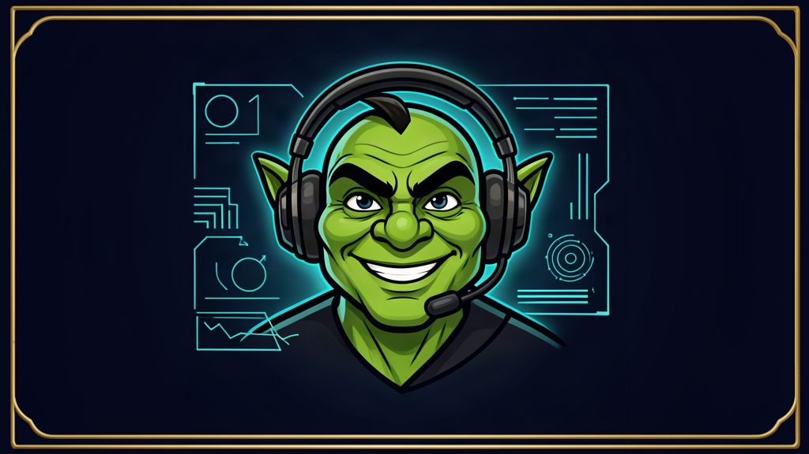

# Macro Goblin

<p align="center">
  
</p>

<p align="center"><strong>Tiny goblin. Big macro.</strong></p>

Macro Goblin is a local, read-only League of Legends macro companion. It speaks and displays lightweight reminders for objective timers, item adaptation, CS pace, deaths, and simple pattern reads.

It does **not** need an LLM to run. The default mode is deterministic Python logic.

## What it feels like

A sharp duo partner on your second monitor: quick timers, one useful focus line, clear item plan, and no fake confidence. Funny name, serious safety posture.

## Safety posture

Macro Goblin uses Riot's local Live Client Data API and Riot Data Dragon only.

It does **not**:

- read League process memory
- inject DLLs
- hook DirectX
- sniff packets
- automate mouse/keyboard input
- install low-level keyboard hooks
- upload match data

The overlay hotkeys use Windows `RegisterHotKey`, and the local dashboard binds to `127.0.0.1` only.

See [`docs/SAFETY.md`](docs/SAFETY.md) for details.

## Requirements

- Windows recommended for the overlay and built-in voice path
- Python 3.9+
- League of Legends in **Borderless** mode for the overlay
- Internet access for Riot Data Dragon item/champion metadata

No required pip packages are currently needed; the runtime is stdlib-only.

## Quick start

Before queueing, run the doctor:

```bat
python lol_coach.py --doctor
```

Then test the deterministic demo without voice:

```bat
python lol_coach.py --demo --speed 20 --no-voice
```

To run for a real game:

```bat
run_coach.bat
```

or manually:

```bat
python lol_coach.py --overlay --capture --log
```

Start it before you queue. It will wait until the League Live Client endpoint appears in-game.

## Common commands

```bat
python lol_coach.py --doctor
python lol_coach.py --demo --speed 20 --no-voice
python lol_coach.py --overlay
python lol_coach.py --overlay-edit
python lol_coach.py --capture
python lol_coach.py --replay captures\<timestamp> --speed 20 --no-voice
python lol_coach.py --web
python lol_coach.py --log
python lol_coach.py --me YourSummonerName
```

`--web` binds to `127.0.0.1:8765` only. It does not listen on the LAN.

Show/hide overlay: `Ctrl+Shift+O`.
Move/save overlay while running: `Ctrl+Shift+M`, drag the card, then press `Ctrl+Shift+M` again to return to click-through live mode.

## Optional LLM mode

Claude mode is optional and off by default.

```bat
setx ANTHROPIC_API_KEY your_key_here
python lol_coach.py --claude
```

If `--claude` is not passed, no LLM/API call is made.

## Generated local files

These are ignored by git:

- `captures/` raw local snapshots for replay/debugging
- `logs/` callout logs
- `reports/` match notes
- `overlay_layout.json` local overlay position
- `__pycache__/`, `*.pyc`
- `.env`

Do not commit personal captures/logs/reports when sharing the repo.

## Verification

```bat
python tests\test_shop.py
python tests\test_patterns.py
python tests\test_coach.py
python lol_coach.py --doctor
python lol_coach.py --demo --speed 40 --no-voice
```

Optional manual checks:

```bat
python tests\smoke_overlay.py
python tests\voice_check.py
```

## Brand

See [`docs/BRAND.md`](docs/BRAND.md). Generated assets live in `assets/` and are mirrored under `docs/assets/` for GitHub Pages.

## Troubleshooting

See [`docs/TROUBLESHOOTING.md`](docs/TROUBLESHOOTING.md).
